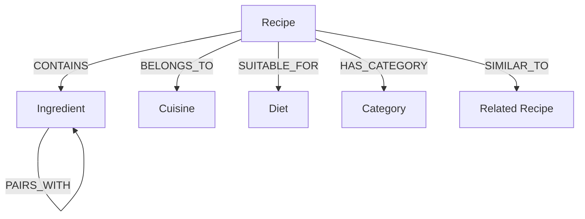

# KitchenGraph 🥑🕸️

> *"Discover what you can cook, one connection at a time."*

KitchenGraph is a production-grade, graph-powered recipe and ingredient discovery web application backed by **CognoDB** using openCypher over the Bolt protocol via the official `neo4j-driver`.

Built for the Wexa AI *"Build a Graph Database Application"* take-home assignment.

---

## 🌟 Overview & Core Concept

Traditional recipe apps treat data as isolated flat tables. FoodGraph models culinary relationships as a rich graph network where recipes, ingredients, substitutions, cuisines, and diets are interconnected nodes.

### Key Features:
1. **"What's in your kitchen?" Ingredient Discovery**: Select available ingredients; CognoDB traverses the graph to find matching recipes, ranks them by match percentage, and identifies missing ingredients.
2. **Smart Ingredient Substitutions**: Explore culinary replacements (e.g. `Butter` → `Ghee` / `Olive Oil`) with substitution ratios and culinary notes.
3. **Multi-Hop Traversal**: Traverse `(:Ingredient) → (:Recipe) → (:Cuisine)` and `(:Diet)` to explore regional traditions and dietary suitability.
4. **Similar Recipe Discovery**: Discover related recipes naturally through shared ingredient graph overlap (`(r1:Recipe)-[:CONTAINS]->(i:Ingredient)<-[:CONTAINS]-(r2:Recipe)`).
5. **Interactive 2D Graph Explorer**: Visualise graph topology with node dragging, zoom/pan controls, type filtering, and an openCypher inspection drawer.
6. **Graceful Fallback & Zero Downtime**: Seamlessly falls back to an in-memory graph mirror if database credentials are not yet configured.

---

## 💡 Why a Graph Database?

Food discovery is fundamentally a **relationship-heavy network problem**. 

### The Relational DB Problem (Awkward & Slow):
In a relational SQL database:
- Finding recipes you can cook requires complex `JOIN`s across `recipes`, `recipe_ingredients`, `ingredients`, and `ingredient_substitutions`.
- Finding similar recipes based on shared ingredients requires expensive self-joins on junction tables: `recipes JOIN recipe_ingredients r1 JOIN recipe_ingredients r2 JOIN recipes`.
- Calculating missing ingredients and checking whether missing items have available substitutes requires nested subqueries or multiple join passes that quickly degrade performance as data grows.

### The CognoDB Graph Advantage (Native & Fast):
In CognoDB with openCypher:
- Relationships are **first-class entities** stored as pointers, eliminating expensive table joins.
- Traversals like *"Find recipes sharing at least 3 ingredients with Butter Chicken"* are expressed naturally in Cypher:
  ```cypher
  MATCH (r:Recipe {id: 'rec-butter-chicken'})-[:CONTAINS]->(i:Ingredient)<-[:CONTAINS]-(related:Recipe)
  RETURN related, count(i) AS sharedCount
  ORDER BY sharedCount DESC
  ```
- Multi-hop path traversals execute in milliseconds regardless of database depth.

---

## 🏗️ System Architecture

```
User Browser
    ↓ (HTTP / React Server Components)
Next.js App Router & API Route Handlers
    ↓ (TypeScript / Cypher Queries)
Official Neo4j Driver (neo4j-driver)
    ↓ (Bolt Protocol over TLS)
CognoDB Cloud Graph Database Engine
```

---

## 📊 Graph Data Model



### Node Schema:
- **`Recipe`**: `id`, `name`, `description`, `prepTime`, `cookTime`, `servings`, `difficulty`, `image`, `instructions`
- **`Ingredient`**: `id`, `name`, `category`
- **`Cuisine`**: `id`, `name`, `description`
- **`Diet`**: `id`, `name`, `description`
- **`Category`**: `id`, `name`

### Relationship Schema:
- `(:Recipe)-[:CONTAINS {quantity: "500", unit: "g"}]->(:Ingredient)`
- `(:Ingredient)-[:SUBSTITUTES {ratio: "1:1", note: "Clarified butter"}]->(:Ingredient)`
- `(:Ingredient)-[:PAIRS_WITH]->(:Ingredient)`
- `(:Recipe)-[:BELONGS_TO]->(:Cuisine)`
- `(:Recipe)-[:SUITABLE_FOR]->(:Diet)`
- `(:Recipe)-[:HAS_CATEGORY]->(:Category)`
- `(:Recipe)-[:SIMILAR_TO]->(:Recipe)`

---

## 🔍 Important openCypher Queries

All Cypher queries in FoodGraph use parameterized inputs (`$param`) to prevent Cypher injection vulnerabilities.

### 1. Ingredient-Based Recipe Match (Ranking + Missing Ingredients)
```cypher
MATCH (r:Recipe)-[:CONTAINS]->(i:Ingredient)
WITH r, collect(toLower(i.name)) AS reqNames, collect(i) AS reqIngredients
WITH r, reqNames, reqIngredients,
     [name IN reqNames WHERE name IN $userIngredients] AS matchedNames
WITH r, reqNames, reqIngredients, matchedNames,
     size(matchedNames) AS matchedCount,
     size(reqNames) AS totalCount
WHERE matchedCount > 0
WITH r, reqIngredients, matchedNames, matchedCount, totalCount,
     toInteger(round((toFloat(matchedCount) / totalCount) * 100)) AS matchPercentage,
     [ing IN reqIngredients WHERE NOT toLower(ing.name) IN $userIngredients | ing.name] AS missingIngredients
MATCH (r)-[:BELONGS_TO]->(c:Cuisine)
OPTIONAL MATCH (r)-[:SUITABLE_FOR]->(d:Diet)
RETURN r, c.name AS cuisine, collect(DISTINCT d.name) AS diets,
       matchPercentage, matchedCount, totalCount, missingIngredients
ORDER BY matchPercentage DESC, matchedCount DESC, r.name ASC
```

### 2. Multi-Hop Traversal (`Ingredient → Recipe → Cuisine`)
```cypher
MATCH (i:Ingredient) WHERE toLower(i.name) = toLower($ingredientName)
MATCH (r:Recipe)-[:CONTAINS]->(i)
MATCH (r)-[:BELONGS_TO]->(c:Cuisine)
OPTIONAL MATCH (r)-[:SUITABLE_FOR]->(d:Diet)
RETURN i, r, c, collect(d) AS diets
```

### 3. Ingredient Substitutions
```cypher
MATCH (i:Ingredient {id: $ingredientId})
MATCH (i)-[sub:SUBSTITUTES]->(alt:Ingredient)
OPTIONAL MATCH (r:Recipe)-[:CONTAINS]->(alt)
RETURN alt, sub.ratio AS ratio, sub.note AS note, count(r) AS usageCount
ORDER BY usageCount DESC
```

### 4. Similar Recipes via Shared Ingredients Graph Traversal
```cypher
MATCH (r:Recipe {id: $recipeId})
MATCH (r)-[:CONTAINS]->(i:Ingredient)<-[:CONTAINS]-(related:Recipe)
WHERE related.id <> $recipeId
WITH related, count(i) AS sharedCount, collect(i.name) AS sharedIngredients
MATCH (related)-[:BELONGS_TO]->(c:Cuisine)
RETURN related, c.name AS cuisine, sharedCount, sharedIngredients
ORDER BY sharedCount DESC, related.name ASC
LIMIT 6
```

---

## 🛠️ Project Structure

```
foodgraph/
├── app/
│   ├── page.tsx                      # Homepage with Hero & Kitchen Ingredient Finder
│   ├── recipes/
│   │   ├── page.tsx                  # Recipe catalog & multi-filter
│   │   └── [id]/page.tsx             # Recipe detail, substitutions & sub-graph
│   ├── ingredients/
│   │   ├── page.tsx                  # Ingredient directory & search
│   │   └── [id]/page.tsx             # Ingredient detail, substitutions & recipes
│   ├── explore/page.tsx              # Interactive 2D Graph Explorer
│   ├── api/
│   │   ├── health/route.ts           # CognoDB connection health check
│   │   ├── recipes/match/route.ts    # Multi-ingredient graph matching
│   │   ├── recipes/[id]/route.ts     # Single recipe & similar recipes
│   │   ├── ingredients/route.ts      # Ingredient directory API
│   │   ├── ingredients/[id]/route.ts # Ingredient details API
│   │   └── graph/route.ts            # Graph topology export API
│   ├── layout.tsx                    # Root layout
│   └── globals.css                   # Tailwind styles & theme variables
├── components/
│   ├── Navbar.tsx                    # Header with DB connection status badge
│   ├── Footer.tsx                    # Footer with specs & links
│   ├── IngredientSelector.tsx        # Search box with autocomplete chips
│   ├── IngredientChip.tsx            # Badge component
│   ├── RecipeCard.tsx                # Recipe card with match % pill
│   ├── GraphExplorer.tsx             # Interactive 2D SVG graph visualizer
│   ├── GraphMiniView.tsx             # Sub-graph preview component
│   ├── LoadingSkeleton.tsx           # Skeleton shimmer loaders
│   ├── EmptyState.tsx                # Empty search component
│   └── DatabaseErrorBanner.tsx       # Graceful DB error notice
├── lib/
│   ├── cognodb.ts                    # Neo4j driver connection pool manager
│   ├── cypher.ts                     # Parameterised Cypher queries & fallback engine
│   ├── seed-data.ts                  # Pure seed dataset (45+ recipes, 90+ ingredients)
│   └── utils.ts                      # Helper functions
├── scripts/
│   └── seed.ts                       # CognoDB data seeder (npm run seed)
├── .env.example                      # Environment variables template
├── package.json                      # Dependencies and scripts
└── tsconfig.json                     # TypeScript configuration
```

---

## 🚀 Getting Started

### 1. Prerequisites
- Node.js 18+ and npm installed.
- CognoDB Cloud database instance (or any openCypher Bolt-compatible Neo4j instance).

### 2. Environment Setup
Copy `.env.example` to `.env.local`:
```bash
cp .env.example .env.local
```

Fill in your CognoDB credentials:
```env
COGNODB_URI=bolt+s://your-instance.databases.cognodb.cloud
COGNODB_USERNAME=cognodb
COGNODB_PASSWORD=your-actual-password
```

### 3. Installation
```bash
npm install
```

### 4. Seed CognoDB Graph Database
Run the seed script to merge 45+ recipes, 90+ ingredients, 8 cuisines, 5 diets, 7 categories, and explicit relationships into CognoDB:
```bash
npm run seed
```

### 5. Run Local Development Server
```bash
npm run dev
```
Open [http://localhost:3000](http://localhost:3000) in your browser.

---

## 🚢 Deployment on Vercel

1. Push your repository to GitHub.
2. Import the repository into [Vercel](https://vercel.com).
3. Add Environment Variables in Vercel project settings:
   - `COGNODB_URI`
   - `COGNODB_USERNAME`
   - `COGNODB_PASSWORD`
4. Click **Deploy**. Vercel will automatically build the Next.js production bundle.

---

## 🛡️ License & Credits

Designed & built for the Wexa AI Take-Home Assignment. Backed by CognoDB Graph Engine & openCypher.
